```mermaid
graph TD

    subgraph 2644["K.E.N.D.R.A AI Platform"]
        subgraph 2645["Platform Adaptation - Environments"]
            2691["Environment Configuration<br>Python"]
        end
        subgraph 2646["Specialized Processing Modules"]
            2688["Neural Network Modules<br>Python"]
            2689["Computer Vision Modules<br>Python"]
            2690["FFMPEG Audio Converter<br>Python"]
        end
        subgraph 2647["System Configuration & Control - AppRegistry"]
            2684["Permission Manager<br>Python"]
            2685["Debugging Suite<br>Python"]
            2686["Security Monitor<br>Python"]
            2687["User Identity Management<br>Python"]
        end
        subgraph 2648["Application Logic - AppData"]
            2650["External Service Integrations"]
            2667["Global Interaction Manager<br>Python"]
            2668["Voice I/O & Sensing<br>Python"]
            subgraph 2649["Advanced Functions"]
                2681["Self-Modification Capabilities<br>Python"]
                2682["Advanced Voice Processing<br>Python, LiveSpeech"]
                2683["Text-to-Speech Engine<br>Python"]
            end
            subgraph 2651["Data & Knowledge Services"]
                2672["Voice Data Processor<br>Python, PyTorch, Librosa"]
                2673["Knowledge Base Connectors<br>Python"]
                2674["API Key Management<br>Python"]
                2675["User Profile Store<br>Python"]
            end
            subgraph 2652["Core AI Services"]
                2669["Mode & Personality Manager<br>Python"]
                2670["Memory & Context Engine<br>Python, SQLite"]
                2671["Data Analysis & Daemons<br>Python"]
            end
        end
        subgraph 2653["Core System"]
            2665["Kendrah Assistant Core<br>Python"]
            2666["System Management<br>Python"]
        end
        %% Edges at this level - grouped by source
        2665["Kendrah Assistant Core<br>Python"] -->|orchestrates| 2669["Mode & Personality Manager<br>Python"]
        2665["Kendrah Assistant Core<br>Python"] -->|utilizes| 2670["Memory & Context Engine<br>Python, SQLite"]
        2665["Kendrah Assistant Core<br>Python"] -->|leverages| 2671["Data Analysis & Daemons<br>Python"]
        2665["Kendrah Assistant Core<br>Python"] -->|employs| 2672["Voice Data Processor<br>Python, PyTorch, Librosa"]
        2665["Kendrah Assistant Core<br>Python"] -->|adapts with| 2691["Environment Configuration<br>Python"]
        2665["Kendrah Assistant Core<br>Python"] -->|connects to| 2650["External Service Integrations"]
        2681["Self-Modification Capabilities<br>Python"] -->|may alter| 2665["Kendrah Assistant Core<br>Python"]
        2669["Mode & Personality Manager<br>Python"] -->|influences behavior of| 2665["Kendrah Assistant Core<br>Python"]
    end
    subgraph 2654["External Systems"]
        2655["User<br>External Actor"]
        2656["OpenAI Service<br>External LLM API"]
        2657["ElevenLabs Service<br>External TTS/Voice API"]
        2658["DeepSeek Service<br>External LLM API"]
        2659["Other LLM Services<br>Grok, Gemini, Anthropic<br>External APIs"]
        2660["Wikipedia<br>External Knowledge Source"]
        2661["Operating System Services<br>File System, Process Mgmt"]
        2662["Hardware Interfaces<br>Camera, Mic, Screen, Audio Output"]
        2663["FFMPEG CLI Tool<br>External Utility"]
        2664["Python Ecosystem Libraries<br>gTTS, PyAudio, Torch, Requests, etc."]
    end
    %% Edges at this level - grouped by source
    2689["Computer Vision Modules<br>Python"] -->|accesses camera via| 2662["Hardware Interfaces<br>Camera, Mic, Screen, Audio Output"]
    2689["Computer Vision Modules<br>Python"] -->|uses CV libs| 2664["Python Ecosystem Libraries<br>gTTS, PyAudio, Torch, Requests, etc."]
    2690["FFMPEG Audio Converter<br>Python"] -->|invokes CLI tool| 2663["FFMPEG CLI Tool<br>External Utility"]
    2690["FFMPEG Audio Converter<br>Python"] -->|uses utility libs| 2664["Python Ecosystem Libraries<br>gTTS, PyAudio, Torch, Requests, etc."]
    2688["Neural Network Modules<br>Python"] -->|uses ML libs| 2664["Python Ecosystem Libraries<br>gTTS, PyAudio, Torch, Requests, etc."]
    2655["User<br>External Actor"] -->|interacts via voice/text/GUI| 2667["Global Interaction Manager<br>Python"]
    2667["Global Interaction Manager<br>Python"] -->|uses OS features for GUI and files| 2661["Operating System Services<br>File System, Process Mgmt"]
    2667["Global Interaction Manager<br>Python"] -->|accesses screen/mic| 2662["Hardware Interfaces<br>Camera, Mic, Screen, Audio Output"]
    2667["Global Interaction Manager<br>Python"] -->|uses utility libs| 2664["Python Ecosystem Libraries<br>gTTS, PyAudio, Torch, Requests, etc."]
    2668["Voice I/O & Sensing<br>Python"] -->|outputs audio to| 2662["Hardware Interfaces<br>Camera, Mic, Screen, Audio Output"]
    2668["Voice I/O & Sensing<br>Python"] -->|uses STT/TTS libs| 2664["Python Ecosystem Libraries<br>gTTS, PyAudio, Torch, Requests, etc."]
    2650["External Service Integrations"] -->|calls API| 2656["OpenAI Service<br>External LLM API"]
    2650["External Service Integrations"] -->|uses client libs| 2664["Python Ecosystem Libraries<br>gTTS, PyAudio, Torch, Requests, etc."]
    2650["External Service Integrations"] -->|calls API| 2657["ElevenLabs Service<br>External TTS/Voice API"]
    2650["External Service Integrations"] -->|calls API| 2658["DeepSeek Service<br>External LLM API"]
    2650["External Service Integrations"] -->|call APIs| 2659["Other LLM Services<br>Grok, Gemini, Anthropic<br>External APIs"]
    2666["System Management<br>Python"] -->|manages system files via| 2661["Operating System Services<br>File System, Process Mgmt"]
    2684["Permission Manager<br>Python"] -->|interacts with| 2661["Operating System Services<br>File System, Process Mgmt"]
    2684["Permission Manager<br>Python"] -->|controls access to| 2662["Hardware Interfaces<br>Camera, Mic, Screen, Audio Output"]
    2685["Debugging Suite<br>Python"] -->|monitors system via| 2661["Operating System Services<br>File System, Process Mgmt"]
    2686["Security Monitor<br>Python"] -->|analyzes system behavior via| 2661["Operating System Services<br>File System, Process Mgmt"]
    2691["Environment Configuration<br>Python"] -->|configures for| 2661["Operating System Services<br>File System, Process Mgmt"]
    2673["Knowledge Base Connectors<br>Python"] -->|queries| 2660["Wikipedia<br>External Knowledge Source"]
    2672["Voice Data Processor<br>Python, PyTorch, Librosa"] -->|uses ML/audio libs| 2664["Python Ecosystem Libraries<br>gTTS, PyAudio, Torch, Requests, etc."]
    2682["Advanced Voice Processing<br>Python, LiveSpeech"] -->|accesses microphone via| 2662["Hardware Interfaces<br>Camera, Mic, Screen, Audio Output"]
    2682["Advanced Voice Processing<br>Python, LiveSpeech"] -->|uses STT/TTS libs| 2664["Python Ecosystem Libraries<br>gTTS, PyAudio, Torch, Requests, etc."]
    2683["Text-to-Speech Engine<br>Python"] -->|outputs audio to| 2662["Hardware Interfaces<br>Camera, Mic, Screen, Audio Output"]
    2683["Text-to-Speech Engine<br>Python"] -->|uses TTS libs| 2664["Python Ecosystem Libraries<br>gTTS, PyAudio, Torch, Requests, etc."]
    2670["Memory & Context Engine<br>Python, SQLite"] -->|persists data using| 2661["Operating System Services<br>File System, Process Mgmt"]
    2670["Memory & Context Engine<br>Python, SQLite"] -->|uses utility libs| 2664["Python Ecosystem Libraries<br>gTTS, PyAudio, Torch, Requests, etc."]
    2671["Data Analysis & Daemons<br>Python"] -->|runs as background process via| 2661["Operating System Services<br>File System, Process Mgmt"]
```

# K.E.N.D.R.A-RA1018
Arsenally a super intelligent system.

K.E.N.D.R.A.H-RA1018
___

Arsenal'ly a super intelligent system.

An Advanced Autonomous AI System for Next-Gen Productivity and Intelligence

Status: Continues stage
License: Proprietary 
Usage: Intelligence, Cybersecurity & Hacking, Military, OS Assistant, Home Automation, Embedded Systems

K.E.N.D.R.A.H is a highly advanced AI agent designed to operate across diverse environments — from cybersecurity and military intelligence to content creation, development, and home automation. It functions as a real-time, multi-modal assistant that supports voice commands, text input, and camera-based interaction, seamlessly integrating all forms of communication into an intelligent operational flow.

Built-in Frameworks (Current):
___

- BlakDevForge: A cross-platform, self-operating AI agent that lives inside your app — understands your codebase, identifies bugs, improves UI, and evolves your project without developer intervention.
[https://github.com/BlackBlazent/BlackDevForge]

- Cyberlaw: A martial law in cyberspace.
[https://github.com/BCICDIS/Cyberlaw]

Personalities:
Have eight personality traits

🟡 Yellow core
🤍 White core
💚 Green core
🟤 Brown core
🩷 Pink core
🔵 Blue core
💜 Violet core
🖤 Black core

Core Abilities:
___

- Self repair/Self Learning/Self Improvement 
- Write/Read/Modification
- Systems knowledge, Operating System Control & Autonomous 
- Context awareness
- Real-time system threat intelligence, Surveillance, & Security Systems  
- Natural Language Processing & Multi-modal Communication  Support 
- Computer Vision
- Server/Hosting/Real-time synchronize across verified device's
- Multi-tasking
- Data Analysis & Decision Making
- Computing & AI integration 
- Master Biometric Configuration 

Official Hardware System Requirements:
___

1. Full System Deployment (Laptop/Desktop)

Ideal for: Developers, Defense Systems, OS-Level AI Assistant, Real-Time Analysis

Recommended Specs:

    CPU: Intel i7 / AMD Ryzen 7 or better (8 cores+ for multitasking)

    RAM: 32 GB DDR4 (minimum 16 GB)

    Storage: 512 GB SSD NVMe (minimum)

    GPU: Dedicated GPU (NVIDIA RTX 3060+ or AMD equivalent) for CV and ML models

    OS: Linux (Ubuntu 22.04+ preferred), Windows 11 Pro, or custom OS with K.E.N.D.R.A integration

    Network: High-speed Ethernet + Wi-Fi 6 support

    Security: TPM 2.0, Biometric device support

Usage: Enables all features like real-time threat detection, system-wide control, BlakDevForge self-evolution, Cyberlaw enforcement.
2. Mobile & Smart Devices (Phones/Tablets)

Ideal for: On-the-go interaction, remote assistant, voice/natural language interface

Minimum Specs:

CPU: Snapdragon 8 Gen 2 / Apple A16 Bionic or better

    RAM: 8–12 GB LPDDR5

    Storage: 128–256 GB UFS 3.1

    GPU: Integrated, high-efficiency AI processing core

    OS: Android 13+ / iOS 16+ with custom wrapper or K.E.N.D.R.A interface

     Security: Biometric sensors, Secure Enclave support

Usage: Voice communication, CV, lightweight analytics, remote sync with server, command execution.
3. Embedded & IoT Systems

Ideal for: Home automation, surveillance, military drones, and edge intelligence

Minimum Specs:

    CPU: ARM Cortex-A72 Quad-core (Raspberry Pi 4+/Jetson Nano/Xavier NX)

    RAM: 4–8 GB LPDDR4

    Storage: 32–128 GB (eMMC or SD with fast I/O)

    GPU: Optional – Jetson GPUs for CV models

    OS: Embedded Linux (Yocto, Ubuntu Core, custom RTOS)

    Connectivity: Ethernet/Wi-Fi + Bluetooth

    Power: Optimized for low power with UPS or battery modules

    Security: Encrypted boot, secure update channel, biometric module optional

Usage: Real-time automation, edge threat detection, biometric access, and environmental awareness.
Special Notes

    K.E.N.D.R.A cores (personality modules) scale based on available resources. Devices with lower specs may limit core interactions or restrict full autonomy.

    Cloud Sync recommended for lower-end devices to offload processing to central K.E.N.D.R.A server instances.

    Military & Critical Infrastructure integrations must use hardened, audited systems with encrypted communications and air-gapped backups.

Quick Detailed Fathom Statement:
___

    Real-Time Voice Interaction: K.E.N.D.R.A.H processes and responds to voice commands instantly, enabling hands-free workflows and natural conversation.

    Multi-Modal Communication: Supports voice, text, and camera inputs — intelligently processes and integrates information from any input source.

    Autonomous Project Generation: Capable of initiating, managing, and completing tasks from simple assignments to highly complex engineering projects.

    Multi-Tasking Power: Efficiently handles up to 20 simultaneous research tasks, full-stack application development, data analysis, and content production — all in parallel.

    Advanced Content Creation:

        Generate images, sketches, and videos using AI models

        Create and publish up to 20 video contents simultaneously — fully automated, including scheduling and platform posting

    Custom Labs & Modules:

        Built-in training models for research, content creation, sketching, deepfake manipulation, and more

        Includes a Lab and Testing Workstation for experimental modules and prototype development

    Custom Trading & Data Modules: Supports integration of new trading algorithms and real-time datasets

Coding & Engineering Proficiency:

K.E.N.D.R.A.H excels in software development — able to design, code, and deploy full-stack applications with complex logic, cross-platform support, and scalable infrastructure.
System Intelligence & Optimization:

    Smart Resource Management: Automatically detects available hardware specs and adjusts workflows accordingly

    Customizable Modules: Users can choose which features, training sets, or capabilities to activate, allowing tailored performance

    Rule-Based Smart Execution: Determines the most efficient execution model depending on available resources

Performance Consideration:

Due to its high-level processing, K.E.N.D.R.A.H requires significant RAM, GPU, and storage resources to fully unlock its capabilities. On lower-end systems, users can still benefit from a Basic Workflow Mode, which includes:

    Essay and article writing

    Voice assistance

    Code generation and debugging

    Video and image generation (light usage)

For full functionality, including multi-video generation, real-time system surveillance, and large-scale task automation, high-performance hardware is strongly recommended.

Repo: https://github.com/BCICDIS/K.E.N.D.R.A-RA1018

#KENDRAH_RA1018 #AI #CyberDefense #AutonomousAgent #AIOS

### Reach Out Platforms

## Frameworks (Built-in)
| Name \[🔗]         | Description                                                                                                                                                                              | Category                 |
| ------------------ | ---------------------------------------------------------------------------------------------------------------------------------------------------------------------------------------- | ------------------------ |
| [Cyberlaw](https://github.com/BCICDIS/Cyberlaw)      | A martial law in cyberspace.                                                                                                                                                             | Cybersecurity & Hacking    |
| [BlackDevForge](https://github.com/BlackBlazent/BlackDevForge) | A cross-platform, self-operating AI agent that lives inside your app — understands your codebase, identifies bugs, improves UI, and evolves your project without developer intervention. | AI / Automation / DevOps |

## Current Diagram

**In Repo Diagram**

```mermaid
flowchart TB
    %% External systems
    Python["Python Interpreter / OS Services"]:::external
    ExternalAPI["External Network / APIs"]:::external

    %% Static assets
    AssetsDir["public/assets"]:::assets
    AssetsFile["assets.md"]:::assets

    %% Project metadata
    README["README.md"]:::external
    LICENSE["LICENSE"]:::external
    GITIGNORE[".gitignore"]:::external

    %% Internal monolith
    subgraph "K.E.N.D.R.A AI Platform"
        direction TB
        App["K.E.N.D.R.A AI Platform"]:::internal

        subgraph "Configuration & Environment"
            direction TB
            ConfigEnv["Configuration & Environment"]:::internal
            AssetLoader["Asset Loader"]:::internal
        end

        subgraph "Core Intelligence Logic"
            direction TB
            Cyberlaw["Cyberlaw Framework"]:::internal
            BlackDevForge["BlackDevForge Framework"]:::internal
            IntelligenceModules["Intelligence Modules"]:::internal
        end

        subgraph "Security & Cyber Modules"
            direction TB
            SecurityModules["Security & Cyber Modules"]:::internal
        end
    end

    %% Connections
    App -->|uses| ConfigEnv
    App -->|runs| AssetLoader
    App -->|integrates| Cyberlaw
    App -->|integrates| BlackDevForge
    App -->|executes| IntelligenceModules
    App -->|executes| SecurityModules
    App -->|depends on| Python

    AssetLoader -->|reads| AssetsFile
    AssetsDir -->|contains| AssetsFile
    SecurityModules -->|calls| ExternalAPI

    README -->|docs| App
    LICENSE -->|license| App
    GITIGNORE -->|gitignore| App

    %% Click Events
    click App "https://github.com/bcicdis/k.e.n.d.r.a-ra1018/blob/main/K_E_N_D_R_A_H.py"
    click AssetLoader "https://github.com/bcicdis/k.e.n.d.r.a-ra1018/blob/main/K_E_N_D_R_A_H.py"
    click Cyberlaw "https://github.com/bcicdis/k.e.n.d.r.a-ra1018/blob/main/K_E_N_D_R_A_H.py"
    click BlackDevForge "https://github.com/bcicdis/k.e.n.d.r.a-ra1018/blob/main/K_E_N_D_R_A_H.py"
    click AssetsDir "https://github.com/bcicdis/k.e.n.d.r.a-ra1018/tree/main/public/assets/"
    click AssetsFile "https://github.com/bcicdis/k.e.n.d.r.a-ra1018/blob/main/public/assets/assets.md"
    click README "https://github.com/bcicdis/k.e.n.d.r.a-ra1018/blob/main/README.md"
    click LICENSE "https://github.com/bcicdis/k.e.n.d.r.a-ra1018/tree/main/LICENSE"
    click GITIGNORE "https://github.com/bcicdis/k.e.n.d.r.a-ra1018/blob/main/.gitignore"

    %% Styles
    classDef internal fill:#ADD8E6,stroke:#0000FF
    classDef external fill:#D3D3D3,stroke:#808080
    classDef assets fill:#90EE90,stroke:#008000
```

**Image Diagram**

