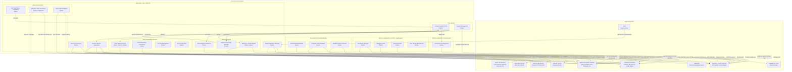

# K.E.N.D.R.A-RA1018
Arsenally a super intelligent system.

# Code Visualization

```mermaid
graph TD

    subgraph 2644["K.E.N.D.R.A AI Platform"]
        subgraph 2645["Platform Adaptation - Environments"]
            2691["Environment Configuration<br>Python"]
        end
        subgraph 2646["Specialized Processing Modules"]
            2688["Neural Network Modules<br>Python"]
            2689["Computer Vision Modules<br>Python"]
            2690["FFMPEG Audio Converter<br>Python"]
        end
        subgraph 2647["System Configuration & Control - AppRegistry"]
            2684["Permission Manager<br>Python"]
            2685["Debugging Suite<br>Python"]
            2686["Security Monitor<br>Python"]
            2687["User Identity Management<br>Python"]
        end
        subgraph 2648["Application Logic - AppData"]
            2650["External Service Integrations"]
            2667["Global Interaction Manager<br>Python"]
            2668["Voice I/O & Sensing<br>Python"]
            subgraph 2649["Advanced Functions"]
                2681["Self-Modification Capabilities<br>Python"]
                2682["Advanced Voice Processing<br>Python, LiveSpeech"]
                2683["Text-to-Speech Engine<br>Python"]
            end
            subgraph 2651["Data & Knowledge Services"]
                2672["Voice Data Processor<br>Python, PyTorch, Librosa"]
                2673["Knowledge Base Connectors<br>Python"]
                2674["API Key Management<br>Python"]
                2675["User Profile Store<br>Python"]
            end
            subgraph 2652["Core AI Services"]
                2669["Mode & Personality Manager<br>Python"]
                2670["Memory & Context Engine<br>Python, SQLite"]
                2671["Data Analysis & Daemons<br>Python"]
            end
        end
        subgraph 2653["Core System"]
            2665["Kendrah Assistant Core<br>Python"]
            2666["System Management<br>Python"]
        end
        %% Edges at this level - grouped by source
        2665["Kendrah Assistant Core<br>Python"] -->|orchestrates| 2669["Mode & Personality Manager<br>Python"]
        2665["Kendrah Assistant Core<br>Python"] -->|utilizes| 2670["Memory & Context Engine<br>Python, SQLite"]
        2665["Kendrah Assistant Core<br>Python"] -->|leverages| 2671["Data Analysis & Daemons<br>Python"]
        2665["Kendrah Assistant Core<br>Python"] -->|employs| 2672["Voice Data Processor<br>Python, PyTorch, Librosa"]
        2665["Kendrah Assistant Core<br>Python"] -->|adapts with| 2691["Environment Configuration<br>Python"]
        2665["Kendrah Assistant Core<br>Python"] -->|connects to| 2650["External Service Integrations"]
        2681["Self-Modification Capabilities<br>Python"] -->|may alter| 2665["Kendrah Assistant Core<br>Python"]
        2669["Mode & Personality Manager<br>Python"] -->|influences behavior of| 2665["Kendrah Assistant Core<br>Python"]
    end
    subgraph 2654["External Systems"]
        2655["User<br>External Actor"]
        2656["OpenAI Service<br>External LLM API"]
        2657["ElevenLabs Service<br>External TTS/Voice API"]
        2658["DeepSeek Service<br>External LLM API"]
        2659["Other LLM Services<br>Grok, Gemini, Anthropic<br>External APIs"]
        2660["Wikipedia<br>External Knowledge Source"]
        2661["Operating System Services<br>File System, Process Mgmt"]
        2662["Hardware Interfaces<br>Camera, Mic, Screen, Audio Output"]
        2663["FFMPEG CLI Tool<br>External Utility"]
        2664["Python Ecosystem Libraries<br>gTTS, PyAudio, Torch, Requests, etc."]
    end
    %% Edges at this level - grouped by source
    2689["Computer Vision Modules<br>Python"] -->|accesses camera via| 2662["Hardware Interfaces<br>Camera, Mic, Screen, Audio Output"]
    2689["Computer Vision Modules<br>Python"] -->|uses CV libs| 2664["Python Ecosystem Libraries<br>gTTS, PyAudio, Torch, Requests, etc."]
    2690["FFMPEG Audio Converter<br>Python"] -->|invokes CLI tool| 2663["FFMPEG CLI Tool<br>External Utility"]
    2690["FFMPEG Audio Converter<br>Python"] -->|uses utility libs| 2664["Python Ecosystem Libraries<br>gTTS, PyAudio, Torch, Requests, etc."]
    2688["Neural Network Modules<br>Python"] -->|uses ML libs| 2664["Python Ecosystem Libraries<br>gTTS, PyAudio, Torch, Requests, etc."]
    2655["User<br>External Actor"] -->|interacts via voice/text/GUI| 2667["Global Interaction Manager<br>Python"]
    2667["Global Interaction Manager<br>Python"] -->|uses OS features for GUI and files| 2661["Operating System Services<br>File System, Process Mgmt"]
    2667["Global Interaction Manager<br>Python"] -->|accesses screen/mic| 2662["Hardware Interfaces<br>Camera, Mic, Screen, Audio Output"]
    2667["Global Interaction Manager<br>Python"] -->|uses utility libs| 2664["Python Ecosystem Libraries<br>gTTS, PyAudio, Torch, Requests, etc."]
    2668["Voice I/O & Sensing<br>Python"] -->|outputs audio to| 2662["Hardware Interfaces<br>Camera, Mic, Screen, Audio Output"]
    2668["Voice I/O & Sensing<br>Python"] -->|uses STT/TTS libs| 2664["Python Ecosystem Libraries<br>gTTS, PyAudio, Torch, Requests, etc."]
    2650["External Service Integrations"] -->|calls API| 2656["OpenAI Service<br>External LLM API"]
    2650["External Service Integrations"] -->|uses client libs| 2664["Python Ecosystem Libraries<br>gTTS, PyAudio, Torch, Requests, etc."]
    2650["External Service Integrations"] -->|calls API| 2657["ElevenLabs Service<br>External TTS/Voice API"]
    2650["External Service Integrations"] -->|calls API| 2658["DeepSeek Service<br>External LLM API"]
    2650["External Service Integrations"] -->|call APIs| 2659["Other LLM Services<br>Grok, Gemini, Anthropic<br>External APIs"]
    2666["System Management<br>Python"] -->|manages system files via| 2661["Operating System Services<br>File System, Process Mgmt"]
    2684["Permission Manager<br>Python"] -->|interacts with| 2661["Operating System Services<br>File System, Process Mgmt"]
    2684["Permission Manager<br>Python"] -->|controls access to| 2662["Hardware Interfaces<br>Camera, Mic, Screen, Audio Output"]
    2685["Debugging Suite<br>Python"] -->|monitors system via| 2661["Operating System Services<br>File System, Process Mgmt"]
    2686["Security Monitor<br>Python"] -->|analyzes system behavior via| 2661["Operating System Services<br>File System, Process Mgmt"]
    2691["Environment Configuration<br>Python"] -->|configures for| 2661["Operating System Services<br>File System, Process Mgmt"]
    2673["Knowledge Base Connectors<br>Python"] -->|queries| 2660["Wikipedia<br>External Knowledge Source"]
    2672["Voice Data Processor<br>Python, PyTorch, Librosa"] -->|uses ML/audio libs| 2664["Python Ecosystem Libraries<br>gTTS, PyAudio, Torch, Requests, etc."]
    2682["Advanced Voice Processing<br>Python, LiveSpeech"] -->|accesses microphone via| 2662["Hardware Interfaces<br>Camera, Mic, Screen, Audio Output"]
    2682["Advanced Voice Processing<br>Python, LiveSpeech"] -->|uses STT/TTS libs| 2664["Python Ecosystem Libraries<br>gTTS, PyAudio, Torch, Requests, etc."]
    2683["Text-to-Speech Engine<br>Python"] -->|outputs audio to| 2662["Hardware Interfaces<br>Camera, Mic, Screen, Audio Output"]
    2683["Text-to-Speech Engine<br>Python"] -->|uses TTS libs| 2664["Python Ecosystem Libraries<br>gTTS, PyAudio, Torch, Requests, etc."]
    2670["Memory & Context Engine<br>Python, SQLite"] -->|persists data using| 2661["Operating System Services<br>File System, Process Mgmt"]
    2670["Memory & Context Engine<br>Python, SQLite"] -->|uses utility libs| 2664["Python Ecosystem Libraries<br>gTTS, PyAudio, Torch, Requests, etc."]
    2671["Data Analysis & Daemons<br>Python"] -->|runs as background process via| 2661["Operating System Services<br>File System, Process Mgmt"]
```
